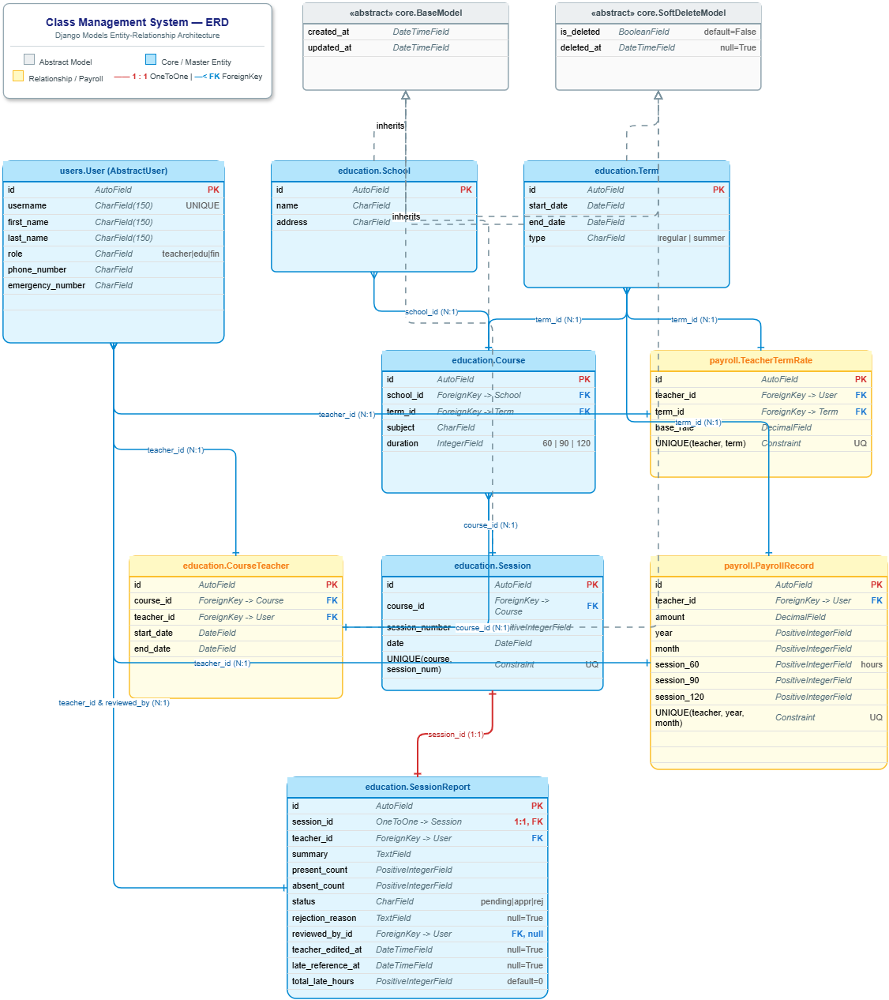

# Class Management System

A Django REST Framework API for managing educational schools, academic terms, courses, class sessions, teacher assignments, session reports, and monthly teacher payroll calculations.

The project was developed as the final project of the Python Bootcamp and completed through four main phases.

**Current Version:** Final Release
**Status:** ✅ Phase 1–4 Completed

---

## Table of Contents

* [Project Overview](#project-overview)
* [System Roles](#system-roles)
* [ERD](#erd)
* [Implemented Features](#implemented-features)

  * [Phase 1 — Users and Authentication](#phase-1--users-and-authentication)
  * [Phase 2 — Educational Management](#phase-2--educational-management)
  * [Phase 3 — Session Reporting Workflow](#phase-3--session-reporting-workflow)
  * [Phase 4 — Payroll Calculation](#phase-4--payroll-calculation)
* [Optional Features Implemented](#optional-features-implemented)
* [Project Architecture](#project-architecture)
* [Installation and Setup](#installation-and-setup)
* [Authentication](#authentication)
* [API Endpoints](#api-endpoints)
* [Session Report Workflow](#session-report-workflow)
* [Payroll Calculation](#payroll-calculation)
* [Testing](#testing)
* [API Documentation](#api-documentation)
* [Django Admin](#django-admin)
* [Technical Decisions](#technical-decisions)
* [Known Limitations](#known-limitations)
* [Project Phases](#project-phases)

---

# Project Overview

This project represents a simplified educational management system in which an educational company works with multiple schools and manages teachers and classes.

The main workflow is:

1. An Education Officer creates schools, academic terms, and courses.
2. Teachers are assigned to courses for specific date ranges.
3. The Education Officer schedules class sessions in advance.
4. A Teacher submits a report after a session has been held.
5. The Education Officer reviews and approves or rejects the report.
6. Rejected reports can be edited and resubmitted by the Teacher.
7. The Finance Officer defines a base rate for each Teacher in each Term.
8. Monthly payroll is calculated based on approved session reports.
9. Late reports receive a percentage penalty based on the number of late hours.

The project is implemented as a REST API using Django and Django REST Framework.

---

# System Roles

The system contains three main roles.

## `teacher`

Teachers can:

* View their assigned courses.
* View their course assignments.
* Submit session reports for their own sessions.
* Edit rejected reports and resubmit them.
* View only their own reports.
* View their monthly report summary.
* View their own payroll history.

## `education_officer`

Education Officers can:

* Manage schools.
* Manage academic terms.
* Manage courses.
* Assign teachers to courses.
* Schedule and manage sessions.
* View submitted session reports.
* Filter reports by school, course, teacher, and date range.
* Approve or reject reports.
* Provide a rejection reason.

## `finance_officer`

Finance Officers can:

* Define a base payroll rate for a Teacher in a Term.
* View teacher-term rates.
* Calculate payroll for all active teachers for a specific month.
* View calculated payroll records for a specific month.

Each user has exactly one role, and API access is controlled using role-based permissions.

---

# ERD

The following Entity Relationship Diagram represents the main data models and relationships in the system.



The main domain flow is:

```text
User
 │
 ├── Teacher
 │      │
 │      ├── CourseTeacher
 │      │        │
 │      │        └── Course
 │      │                 │
 │      │                 └── Session
 │      │                          │
 │      │                          └── SessionReport
 │      │
 │      ├── TeacherTermRate
 │      │
 │      └── PayrollRecord
 │
School
 │
 └── Course

Term
 │
 ├── Course
 │
 └── TeacherTermRate
```

---

# Implemented Features

# Phase 1 — Users and Authentication

The first phase focused on the foundation of the system.

Implemented features:

* Custom User model based on Django `AbstractUser`.
* Three user roles:

  * `teacher`
  * `education_officer`
  * `finance_officer`
* Teacher contact information:

  * Phone number
  * Emergency phone number
* JWT authentication using `djangorestframework-simplejwt`.
* Role-based permissions.
* Current authenticated user endpoint.
* User profile endpoint.
* Role-specific dashboard endpoints.
* Django management command for creating users.

Example:

```bash
python manage.py create_user --role=teacher
```

Valid roles:

```text
teacher
education_officer
finance_officer
```

The project does not provide public user registration. Users are created by the system administrator.

---

# Phase 2 — Educational Management

The second phase introduced the main educational entities.

The following models are implemented:

* `School`
* `Term`
* `Course`
* `CourseTeacher`

## School Management

Education Officers can:

* Create schools.
* View schools.
* Update schools.
* Soft-delete schools.

A school contains basic information such as:

* Name
* Address

---

## Term Management

Each academic term contains:

* `start_date`
* `end_date`
* `type`

Supported term types:

```text
regular
summer
```

Implemented validation rules include:

* The term start date must be the first day of a month.
* The end date must be after the start date.
* Academic terms cannot overlap.

---

## Course Management

Each course belongs to:

* One School
* One Term

A course contains:

* Subject
* Session duration

Supported session durations are:

```text
60 minutes
90 minutes
120 minutes
```

Courses can be filtered by:

```text
school
term
teacher
```

Teachers can only view courses assigned to them.

---

## Teacher Assignment

Teachers are assigned to courses using the `CourseTeacher` model.

Each assignment contains:

* `course_obj`
* `teacher`
* `start_date`
* `end_date`

The system supports multiple teachers for the same course during different time periods.

Example:

```text
Teacher A
July 1 → July 31

Teacher B
August 1 → September 30
```

The system validates that teacher assignment periods:

* Are inside the course term.
* Have a valid start and end date.
* Do not overlap with another teacher assignment for the same course.

---

# Phase 3 — Session Reporting Workflow

Phase 3 introduced class sessions and the complete reporting workflow.

The main models are:

* `Session`
* `SessionReport`

---

## Session Management

Each session belongs to one course and contains:

* `session_number`
* `date`

Implemented rules include:

* Session numbers are unique within a course.
* A course cannot have duplicate sessions for the same date.
* Session dates must be inside the related term.
* Sessions are created and managed by the Education Officer.
* Future sessions can be scheduled in advance.
* Sessions support soft deletion.

---

## Session Reports

Each session can have only one report.

The relationship between `Session` and `SessionReport` is implemented using `OneToOneField`.

A report contains:

* `session`
* `teacher`
* `summary`
* `present_count`
* `absent_count`
* `status`
* `rejection_reason`
* `reviewed_by`
* `teacher_edited_at`
* `late_reference_at`
* `total_late_hours`

Supported report statuses:

```text
pending
approved
rejected
```

---

## Session Report Rules

The system enforces the following rules:

* Only Teachers can create session reports.
* Teachers can only submit reports for their own courses.
* The Teacher must have been responsible for the course on the session date.
* Reports cannot be submitted for future sessions.
* Only one report can exist for each session.
* Teachers can only view their own reports.
* Education Officers can review reports.
* Teachers cannot approve or reject reports.
* Education Officers cannot modify report content.
* Rejecting a report requires a rejection reason.
* Approved reports are locked.
* Approved reports cannot be edited.
* Rejected reports can be edited by the Teacher.
* Resubmitted reports return to the `pending` state.

---

# Phase 4 — Payroll Calculation

The final phase introduced teacher-term rates and monthly payroll calculations.

The main payroll models are:

* `TeacherTermRate`
* `PayrollRecord`

---

## Teacher Term Rate

The Finance Officer can define a base rate for a Teacher in a specific Term.

The `TeacherTermRate` model contains:

* `teacher`
* `term`
* `base_rate`

Each Teacher can have only one rate per Term.

This is enforced using a unique constraint:

```text
teacher + term
```

---

## Payroll Records

The `PayrollRecord` model stores calculated monthly payroll data.

It contains:

* `teacher`
* `year`
* `month`
* `amount`
* `sessions_60`
* `sessions_90`
* `sessions_120`

Each Teacher can have only one payroll record for a specific month.

This is enforced using:

```text
teacher + year + month
```

If payroll is calculated again for the same Teacher and month, the existing record is updated.

---

# Optional Features Implemented

Several optional features from the project requirements were also implemented.

## Current Teacher in Course Details

The course detail endpoint includes a summary of the currently active Teacher.

This avoids requiring a separate request to retrieve the current Teacher assignment.

The returned information includes:

* Teacher ID
* First name
* Last name
* Phone number

---

## Course Filtering

Courses can be filtered by:

```text
school
term
teacher
```

Example:

```http
GET /api/education/courses/?school=1
```

```http
GET /api/education/courses/?term=2
```

```http
GET /api/education/courses/?teacher=5
```

---

## Teacher Monthly Report Summary

Teachers can view a monthly summary of their reports.

The summary includes:

* Number of approved reports.
* Number of rejected reports.
* Number of pending reports.

Example:

```http
GET /api/education/session-reports/monthly-summary/?year=2026&month=9
```

Example response:

```json
{
    "year": 2026,
    "month": 9,
    "approved": 10,
    "rejected": 2,
    "pending": 3
}
```

---

## Late Report Penalty

Instead of completely excluding late reports from payroll calculations, the project implements a percentage penalty system.

Rules:

* The first 48 hours after the reference time have no penalty.
* Every started hour after the deadline adds a `1%` penalty.
* Late hours are rounded upward.
* The maximum penalty is `100%`.
* A report with a `100%` penalty receives no payment.
* Late hours can accumulate across report editing and rejection cycles.

Example:

```text
1 late hour   → 1% penalty
5 late hours  → 5% penalty
50 late hours → 50% penalty
120 hours     → 100% penalty
```

---

# Project Architecture

```text
project_root/
│
├── config/
│   ├── settings.py
│   ├── urls.py
│   ├── asgi.py
│   └── wsgi.py
│
├── core/
│   └── models.py
│       ├── BaseModel
│       ├── SoftDeleteModel
│       └── SoftDeleteManager
│
├── users/
│   ├── models.py
│   ├── serializers.py
│   ├── views.py
│   ├── permissions.py
│   ├── urls.py
│   ├── admin.py
│   │
│   ├── management/
│   │   └── commands/
│   │       └── create_user.py
│   │
│   └── tests/
│
├── education/
│   ├── models/
│   │   ├── school.py
│   │   ├── term.py
│   │   ├── course.py
│   │   ├── session.py
│   │   └── session_report.py
│   │
│   ├── serializers/
│   │   ├── school.py
│   │   ├── term.py
│   │   ├── course.py
│   │   ├── session.py
│   │   └── session_report.py
│   │
│   ├── views/
│   │   ├── school.py
│   │   ├── term.py
│   │   ├── course.py
│   │   ├── session.py
│   │   └── session_report.py
│   │
│   ├── migrations/
│   │
│   └── tests/
│       ├── school_tests/
│       ├── term_tests/
│       ├── course_tests/
│       ├── session_tests/
│       └── session_report_tests/
│
├── payroll/
│   ├── models.py
│   ├── serializers.py
│   ├── services.py
│   ├── urls.py
│   ├── admin.py
│   │
│   ├── views/
│   │   ├── payroll.py
│   │   └── teacher_term_rate.py
│   │
│   ├── migrations/
│   │
│   └── tests/
│       ├── teacher_term_rate_tests/
│       ├── payroll_record_tests/
│       └── payroll_service_tests/
│
├── docs/
│   └── ERD/
│       ├── Class_Management_System_ERD.drawio
│       └── Class_Management_System_ERD.drawio.png
│
├── manage.py
├── requirements.txt
└── README.md
```

---

# Installation and Setup

## Prerequisites

The project requires:

* Python 3.10+
* PostgreSQL
* Django
* Django REST Framework

---

## Clone the Repository

```bash
git clone <repository-url>
cd class-management-system
```

---

## Create a Virtual Environment

```bash
python -m venv venv
```

Activate the virtual environment.

### Windows

```bash
venv\Scripts\activate
```

### Linux / macOS

```bash
source venv/bin/activate
```

---

## Install Dependencies

```bash
pip install -r requirements.txt
```

---

## Configure PostgreSQL

Create a PostgreSQL database and user.

Then configure the database settings in:

```text
config/settings.py
```

The project uses PostgreSQL through Django's PostgreSQL backend.

Example database configuration:

```python
DATABASES = {
    "default": {
        "ENGINE": "django.db.backends.postgresql",
        "NAME": "class_management_system_db",
        "USER": "class_management_system_user",
        "PASSWORD": "<your-password>",
        "HOST": "localhost",
        "PORT": "5432",
    }
}
```

---

## Run Migrations

```bash
python manage.py migrate
```

---

## Create Users

Example:

```bash
python manage.py create_user --role=teacher
```

Available roles:

```text
teacher
education_officer
finance_officer
```

---

## Run the Development Server

```bash
python manage.py runserver
```

The API will be available at:

```text
http://127.0.0.1:8000/
```

---

# Authentication

Authentication is implemented using JWT.

## Login

```http
POST /api/users/login/
```

The request should contain the user's credentials.

The response includes:

* Access token
* Refresh token

---

## Refresh Token

```http
POST /api/users/token/refresh/
```

---

## Protected Requests

For protected endpoints, send the access token in the request header:

```http
Authorization: Bearer <access_token>
```

---

## Current User

```http
GET /api/users/me/
```

---

## User Profile

```http
GET /api/users/profile/
```

---

# API Endpoints

Base API URL:

```text
/api/
```

---

## Users

| Method | Endpoint                                  | Description                        |
| ------ | ----------------------------------------- | ---------------------------------- |
| `POST` | `/api/users/login/`                       | Obtain JWT tokens                  |
| `POST` | `/api/users/token/refresh/`               | Refresh access token               |
| `GET`  | `/api/users/me/`                          | Get the current authenticated user |
| `GET`  | `/api/users/profile/`                     | Get user profile                   |
| `GET`  | `/api/users/dashboard/teacher/`           | Teacher dashboard                  |
| `GET`  | `/api/users/dashboard/education-officer/` | Education Officer dashboard        |
| `GET`  | `/api/users/dashboard/finance-officer/`   | Finance Officer dashboard          |

---

## Schools

| Method   | Endpoint                       | Description               |
| -------- | ------------------------------ | ------------------------- |
| `GET`    | `/api/education/schools/`      | List schools              |
| `POST`   | `/api/education/schools/`      | Create a school           |
| `GET`    | `/api/education/schools/<id>/` | Retrieve school details   |
| `PUT`    | `/api/education/schools/<id>/` | Update a school           |
| `PATCH`  | `/api/education/schools/<id>/` | Partially update a school |
| `DELETE` | `/api/education/schools/<id>/` | Soft-delete a school      |

---

## Terms

| Method   | Endpoint                     | Description             |
| -------- | ---------------------------- | ----------------------- |
| `GET`    | `/api/education/terms/`      | List terms              |
| `POST`   | `/api/education/terms/`      | Create a term           |
| `GET`    | `/api/education/terms/<id>/` | Retrieve term details   |
| `PUT`    | `/api/education/terms/<id>/` | Update a term           |
| `PATCH`  | `/api/education/terms/<id>/` | Partially update a term |
| `DELETE` | `/api/education/terms/<id>/` | Soft-delete a term      |

---

## Courses

| Method   | Endpoint                       | Description               |
| -------- | ------------------------------ | ------------------------- |
| `GET`    | `/api/education/courses/`      | List courses              |
| `POST`   | `/api/education/courses/`      | Create a course           |
| `GET`    | `/api/education/courses/<id>/` | Retrieve course details   |
| `PUT`    | `/api/education/courses/<id>/` | Update a course           |
| `PATCH`  | `/api/education/courses/<id>/` | Partially update a course |
| `DELETE` | `/api/education/courses/<id>/` | Soft-delete a course      |

Course filters:

```text
school
term
teacher
```

Example:

```http
GET /api/education/courses/?school=1&term=2
```

---

## Teacher Assignments

| Method   | Endpoint                                | Description                    |
| -------- | --------------------------------------- | ------------------------------ |
| `GET`    | `/api/education/courses/teachers/`      | List teacher assignments       |
| `POST`   | `/api/education/courses/teachers/`      | Assign a teacher to a course   |
| `GET`    | `/api/education/courses/teachers/<id>/` | Retrieve assignment details    |
| `PUT`    | `/api/education/courses/teachers/<id>/` | Update an assignment           |
| `PATCH`  | `/api/education/courses/teachers/<id>/` | Partially update an assignment |
| `DELETE` | `/api/education/courses/teachers/<id>/` | Soft-delete an assignment      |

---

## Sessions

| Method   | Endpoint                        | Description                |
| -------- | ------------------------------- | -------------------------- |
| `GET`    | `/api/education/sessions/`      | List sessions              |
| `POST`   | `/api/education/sessions/`      | Create a session           |
| `GET`    | `/api/education/sessions/<id>/` | Retrieve session details   |
| `PUT`    | `/api/education/sessions/<id>/` | Update a session           |
| `PATCH`  | `/api/education/sessions/<id>/` | Partially update a session |
| `DELETE` | `/api/education/sessions/<id>/` | Soft-delete a session      |

Session management is restricted to the Education Officer.

---

## Session Reports

| Method  | Endpoint                                      | Description                        |
| ------- | --------------------------------------------- | ---------------------------------- |
| `GET`   | `/api/education/session-reports/`             | List reports                       |
| `POST`  | `/api/education/session-reports/`             | Create a session report            |
| `GET`   | `/api/education/session-reports/<id>/`        | Retrieve report details            |
| `PUT`   | `/api/education/session-reports/<id>/`        | Update a rejected report           |
| `PATCH` | `/api/education/session-reports/<id>/`        | Partially update a rejected report |
| `PATCH` | `/api/education/session-reports/<id>/review/` | Approve or reject a report         |

Education Officers can filter reports by:

```text
school
course
teacher
start_date
end_date
```

---

## Monthly Report Summary

| Method | Endpoint                                          | Description                              |
| ------ | ------------------------------------------------- | ---------------------------------------- |
| `GET`  | `/api/education/session-reports/monthly-summary/` | Get the Teacher's monthly report summary |

Example:

```http
GET /api/education/session-reports/monthly-summary/?year=2026&month=9
```

---

## Teacher Term Rates

| Method | Endpoint              | Description                |
| ------ | --------------------- | -------------------------- |
| `GET`  | `/api/payroll/rates/` | List teacher-term rates    |
| `POST` | `/api/payroll/rates/` | Create a teacher-term rate |

Only Finance Officers can access these endpoints.

---

## Payroll Calculation

| Method | Endpoint                                            | Description                                      |
| ------ | --------------------------------------------------- | ------------------------------------------------ |
| `POST` | `/api/payroll/calculate/?year=<year>&month=<month>` | Calculate payroll for all active teachers        |
| `GET`  | `/api/payroll/monthly/?year=<year>&month=<month>`   | View monthly payroll records                     |
| `GET`  | `/api/payroll/my-payroll/`                          | View the authenticated Teacher's payroll history |

Example:

```http
POST /api/payroll/calculate/?year=2026&month=9
```

---

# Session Report Workflow

The report lifecycle is:

```text
Session
   │
   ▼
Teacher Creates Report
   │
   ▼
Pending
   │
   ├─────────────── Approve ───────────────► Approved
   │                                             │
   │                                             ▼
   │                                           Locked
   │
   │
   └─────────────── Reject ─────────────────► Rejected
                                                 │
                                                 ▼
                                         Teacher Edits Report
                                                 │
                                                 ▼
                                              Pending
                                                 │
                                                 ▼
                                      Education Officer Reviews
```

Important rules:

* Future session reports cannot be created.
* A Teacher must be assigned to the course on the session date.
* Only one report can exist for a session.
* Approved reports cannot be edited.
* Rejected reports can be edited and resubmitted.
* Rejecting a report requires a rejection reason.
* Teachers cannot review their own reports.
* Education Officers cannot edit report content.

---

# Payroll Calculation

The payroll system calculates the payment for approved session reports.

Session duration affects the base rate.

## 60-Minute Session

```text
60-minute wage = base_rate × 0.7
```

## 90-Minute Session

```text
90-minute wage = base_rate
```

## 120-Minute Session

```text
120-minute wage = base_rate × 1.3
```

The gross payroll is:

```text
wage =
    sessions_90 × base_rate
    +
    sessions_60 × (base_rate × 0.7)
    +
    sessions_120 × (base_rate × 1.3)
```

---

## Summer Term Multiplier

If the related term is a summer term:

```text
final_wage = wage × 1.1
```

---

## Late Penalty

Late reports receive a penalty based on accumulated late hours.

```text
penalty = total_late_hours × 1%
```

The maximum penalty is:

```text
100%
```

The final session wage is:

```text
session_wage = base_session_wage × (1 - penalty)
```

Example:

```text
Base session wage: 1,000,000

Late penalty: 10%

Final session wage:

1,000,000 × (1 - 0.10)

= 900,000
```

If the penalty reaches `100%`:

```text
Final session wage = 0
```

---

# Testing

Testing is implemented for models, serializers, views, permissions, authentication, business rules, and payroll calculations.

The project currently contains **291 test cases** across the main applications.

The test structure follows a separation between:

```text
test_models.py
test_serializers.py
test_views.py
```

This structure makes the tests easier to read and maintain.

---

## User Tests

User-related tests cover:

* User model behavior.
* Authentication.
* JWT login.
* Permissions.
* User profiles.
* Management commands.

Run:

```bash
python manage.py test users.tests
```

---

## Education Tests

The education application contains tests for:

```text
School
Term
Course
Session
SessionReport
```

Run all education tests:

```bash
python manage.py test education.tests
```

Individual examples:

```bash
python manage.py test education.tests.school_tests
```

```bash
python manage.py test education.tests.term_tests
```

```bash
python manage.py test education.tests.course_tests
```

```bash
python manage.py test education.tests.session_tests
```

```bash
python manage.py test education.tests.session_report_tests
```

Covered scenarios include:

* Invalid term date ranges.
* Overlapping terms.
* Invalid course duration.
* Teacher assignment overlap.
* Session uniqueness.
* Session date validation.
* Future report prevention.
* Teacher ownership validation.
* Report approval and rejection.
* Rejection reasons.
* Report resubmission.
* Late report calculation.
* Role-based access control.

---

## Payroll Tests

Payroll tests are divided into:

```text
teacher_term_rate_tests
payroll_record_tests
payroll_service_tests
```

Run all payroll tests:

```bash
python manage.py test payroll.tests
```

Run individual test suites:

```bash
python manage.py test payroll.tests.teacher_term_rate_tests
```

```bash
python manage.py test payroll.tests.payroll_record_tests
```

```bash
python manage.py test payroll.tests.payroll_service_tests
```

Payroll tests cover:

* Teacher-term rate validation.
* Unique rate constraints.
* Payroll record uniqueness.
* Role permissions.
* 60-minute wage calculation.
* 90-minute wage calculation.
* 120-minute wage calculation.
* Summer term multiplier.
* Late penalties.
* Maximum 100% penalty.
* Payroll updates for repeated monthly calculations.
* Teachers without approved reports.

---

## Run the Entire Test Suite

```bash
python manage.py test
```

---

# API Documentation

The project uses `drf-spectacular` to generate OpenAPI documentation.

## OpenAPI Schema

```http
GET /api/schema/
```

## Swagger UI

```text
/api/docs/
```

## ReDoc

```text
/api/redoc/
```

---

# Django Admin

The main project models are also registered in the Django Admin panel.

Admin URL:

```text
/admin/
```

The admin panel can be used for managing and inspecting entities such as:

* Users
* Schools
* Terms
* Courses
* Teacher assignments
* Sessions
* Session reports
* Teacher term rates
* Payroll records

---

# Technical Decisions

## Custom User Model

A custom User model based on `AbstractUser` is used to support:

* System roles.
* Teacher contact information.
* Role-based permissions.

---

## BaseModel

Common timestamp fields are provided through `BaseModel`.

```text
created_at
updated_at
```

This avoids repeating timestamp fields across multiple models.

---

## Soft Delete

Some domain models inherit from `SoftDeleteModel`.

Instead of permanently deleting records, the system can mark them as deleted.

The soft delete system includes:

```text
is_deleted
deleted_at
```

The custom manager returns only non-deleted records by default.

---

## Separate Teacher Assignment Model

The relationship between Teachers and Courses is implemented using a dedicated `CourseTeacher` model instead of a simple many-to-many relationship.

This allows storing:

```text
start_date
end_date
```

It also makes it possible to support different Teachers for the same Course during different time periods.

---

## One-to-One Session Reports

Each session can have only one report.

Therefore, `SessionReport` is connected to `Session` using:

```text
OneToOneField
```

This prevents duplicate reports for the same session.

---

## Service Layer for Payroll

Payroll calculation logic is separated into:

```text
payroll/services.py
```

This keeps the business logic outside the API views and makes it easier to test independently.

The main payroll functions include:

```text
get_late_penalty()
get_session_base_wage()
calculate_teacher_payroll()
```

---

## Role-Based Permissions

Permissions are implemented separately from business logic.

This allows endpoints to enforce role boundaries such as:

```text
Teacher
   ↓
Own courses
Own reports
Own payroll history

Education Officer
   ↓
Educational management
Session management
Report review

Finance Officer
   ↓
Teacher rates
Payroll calculation
Payroll records
```

---

# Known Limitations

The following features are intentionally outside the scope of the current project:

1. No public user registration.
2. No student or parent portal.
3. No web or mobile frontend.
4. No SMS or email notification system.
5. No temporary substitute Teacher for a single session.
6. No overtime module.
7. No school service billing module.
8. No Docker Compose setup.
9. No bulk approval endpoint for session reports.
10. No separate status history model for report review changes.

The system is focused on the REST API and the core business rules required by the final project.

---

# Project Phases

* [x] **Phase 1** — Users, roles, authentication, and permissions
* [x] **Phase 2** — Schools, terms, courses, and teacher assignments
* [x] **Phase 3** — Sessions and complete session report workflow
* [x] **Phase 4** — Teacher-term rates, payroll calculation, late penalties, and final integration

---

# Final Project Status

**Current Version:** Final Release

```text
Phase 1  ████████████████████  Completed
Phase 2  ████████████████████  Completed
Phase 3  ████████████████████  Completed
Phase 4  ████████████████████  Completed
```

The final system supports the complete workflow:

```text
Create Users
      │
      ▼
Create School
      │
      ▼
Create Term
      │
      ▼
Create Course
      │
      ▼
Assign Teacher
      │
      ▼
Schedule Sessions
      │
      ▼
Teacher Submits Session Report
      │
      ▼
Education Officer Reviews Report
      │
      ├── Approve
      │
      └── Reject → Teacher Edits → Resubmits
      │
      ▼
Finance Officer Defines Teacher Rate
      │
      ▼
Monthly Payroll Calculation
      │
      ▼
Teacher Views Payroll History
```

## Final Features Summary

* JWT Authentication
* Role-Based Access Control
* Custom User Model
* School Management
* Non-overlapping Term Management
* Course Management
* Teacher Assignment History
* Teacher Assignment Overlap Prevention
* Course Filtering
* Current Teacher Summary
* Session Scheduling
* Session Validation
* Complete Session Report Workflow
* Report Approval and Rejection
* Rejection Reasons
* Report Resubmission
* Monthly Report Summary
* Teacher-Term Base Rates
* Monthly Payroll Calculation
* Session Duration-Based Payroll
* Summer Term Multiplier
* Late Report Percentage Penalty
* Maximum Penalty Limit
* Payroll History
* Soft Delete
* Django Admin Integration
* OpenAPI Documentation
* Swagger UI
* ReDoc
* Comprehensive Automated Tests

**Status: 🎉 Final Project Completed**
